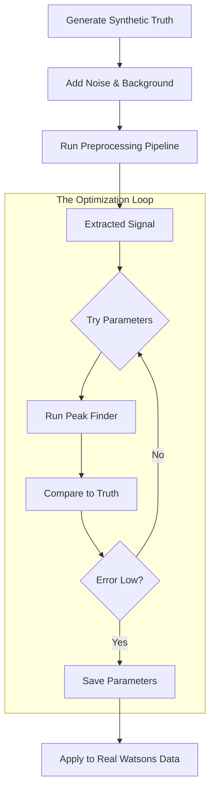

***
# 1. Issue
We will be using a peak detection algorithm to identify chemical signals. Acts as a 'black box' controlled by hyperparameters

***
# 2. Workflow
## Complex Generation
Generate a synthetic 'master' dataset that mimics complexity of a real chemical sample

- Composition: 5 peaks 
	- 3 Oxidation peaks 
	- 2 Reduction peaks
- Variables: 
	- Varying distance between peaks
	- Variable heights
- Output: Dictionary of 'Ground Truth' values

## Pipeline Stress Test 
1. Add noise 
2. Capacitive Tilit 
3. Pass this data through the 'Preproccessing Pipeline'

## Parameter Sweep
Nested loop to test combinations of parameters

## Assessment (Metrics)
1. Count Accuracy
2. Positional Accuracy 
3. Magnitude Accuracy 

